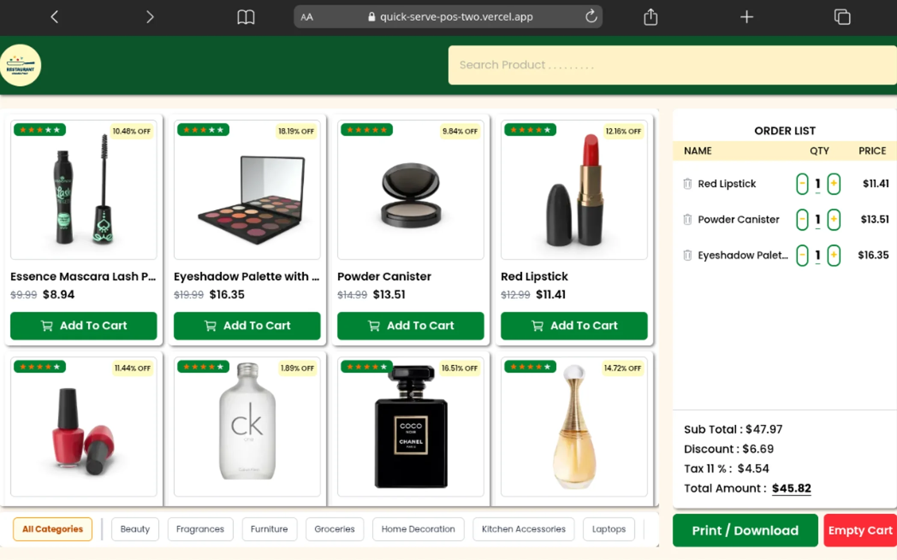
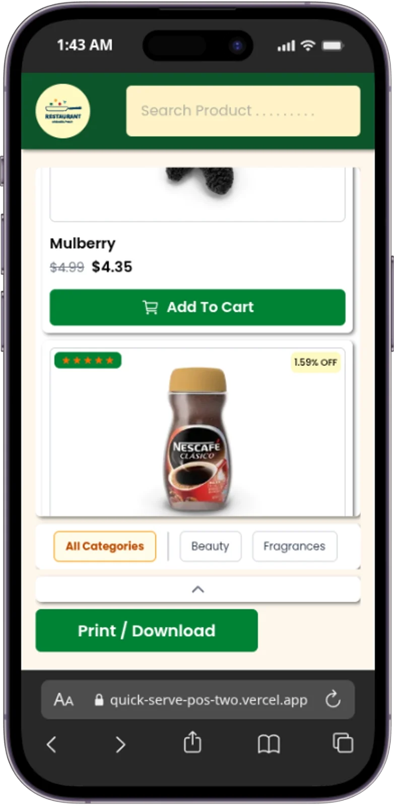

# QuickServe POS

**QuickServe POS** is a lightweight web-based Point of Sale application designed specifically for coffee shops. It provides a fast, simple, and streamlined online ordering experience.

---

## 🎨 Design Preview

  <table>
    <tr>
      <td valign="top" width="50%">
        <h4 align="center">Desktop View</h4>
        
      </td>
      <td valign="top" width="50%">
        <h4 align="center">Mobile View</h4>
        
      </td>
    </tr>
  </table>

---

## 💡 Key Features

Built with simplicity in mind to ensure a quick and effortless ordering process:
1. **Menu Selection**: Customers or cashiers access the website and select items from the coffee menu.
2. **Receipt Printing**: Once the order is confirmed, the system instantly prints the receipt/invoice.

---

## 🛠️ Tech Stack

- **Framework**: [Next.js 16](https://nextjs.org/)
- **UI & Styling**: [React 19](https://react.dev/), [Tailwind CSS v4](https://tailwindcss.com/)
- **State Management**: [Zustand](https://github.com/pmndrs/zustand)
- **Animation & Sliders**: [Motion](https://motion.dev/), [Swiper](https://swiperjs.com/)
- **Icons**: [React Icons](https://react-icons.github.io/react-icons/)
- **Utilities**: Axios, Class Variance Authority (CVA), Clsx, Tailwind Merge
- **Language**: TypeScript

---

## 🚀 Getting Started

This project uses **pnpm** as the package manager.

### 1. Clone the Repository
git clone [https://github.com/your-username/quickserve-pos.git](https://github.com/your-username/quickserve-pos.git)
cd quickserve-pos

### 2. Install Dependencies
pnpm install

### 3. Add env.local
NEXT_PUBLIC_BASE_URL= (your api)

### 4. Run the Development Server
pnpm dev
Open http://localhost:3000 in your browser to view the application.

### 5.Build for Production
pnpm build
pnpm start

👤 Author